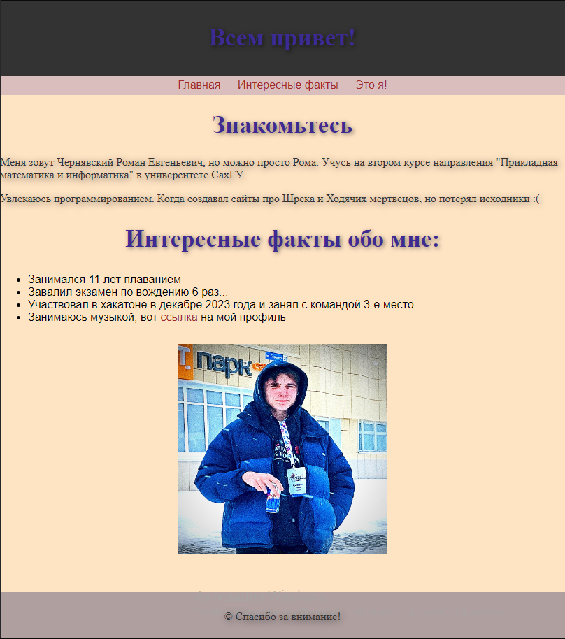

<p align = "center">МИНИСТЕРСТВО НАУКИ И ВЫСШЕГО ОБРАЗОВАНИЯ<br>
РОССИЙСКОЙ ФЕДЕРАЦИИ<br>
ФЕДЕРАЛЬНОЕ ГОСУДАРСТВЕННОЕ БЮДЖЕТНОЕ<br>
ОБРАЗОВАТЕЛЬНОЕ УЧРЕЖДЕНИЕ ВЫСШЕГО ОБРАЗОВАНИЯ<br>
«САХАЛИНСКИЙ ГОСУДАРСТВЕННЫЙ УНИВЕРСИТЕТ»</p>
<br><br><br><br><br><br>
<p align = "center">Институт естественных наук и техносферной безопасности<br>Кафедра информатики<br>Чернявский Роман Евгеньевич</p>
<br><br><br>
<p align = "center"><br><strong>Лабораторная работа №1.«Введение вэб-разработку»</strong><br>01.03.02 Прикладная математика и информатика</p>
<br><br><br><br><br><br><br><br><br><br><br><br>
<p align = "right">Научный руководитель<br>
Соболев Евгений Игоревич</p>
<br><br><br>
<p align = "center">г. Южно-Сахалинск<br>2022 г.</p>
<br><br><br><br><br><br><br><br><br><br><br><br>

<h1 align = "center">Введение</h1>

<p><b>Среда разработки html (HyperText Markup Language)</b> — это язык разметки, который используется для создания веб-страниц. HTML определяет структуру содержимого веб-страницы, такие как заголовки, параграфы, списки, ссылки и изображения. HTML состоит из набора тегов, которые определяют различные элементы страницы и их отображение в браузере.</p>

<br>
<h1 align = "center">Цели и задачи</h1>


<p>Требуется создать сайт с информацией о себе.</p>

<p></p>


<h1 align = "center">Решение</h1>

<p>Для выполнения этой лабораторной работы, я пользовался материалом из интернета и того, что мы проходили на лекции</p>

<h2 align = "center">Файл "Информация обо мне.html"</h2>

```k<!DOCTYPE html>
<html lang="en">
    <head>
        <meta charset="UTF-8">
        <meta name="viewport" content="width, initial-scale=1.0">
        <title>"Информация обо мне"</title>
        <link rel="stylesheet" type="text/css" href="style.css">
        <style>
        p, h1, h2 {
            font-family: 'Times New Roman', Times, serif;
        }

        h1, h2 {
            font-size: 35px;
            color: rgb(62, 43, 146);
            text-shadow: 2px 2px 6px rgba(0, 0, 0, 0.5);
        }

        p {
            font-size: 16px;
            color: #333;
            text-shadow: 2px 2px 10px rgba(0, 0, 0, 0.5);
        }

        .center {
            text-align: center;
        }

        .right {
            text-align: right;
        }
        
        </style>
    </head>

    <body style="background-color: bisque;">
        <header>
            <h1>Всем привет!</h1>
        </header>
        <nav>
            <a href="#hello">Главная</a>
            <a href="#facts">Интересные факты</a>
            <a href="#me">Это я!</a>
        </nav>
        <h1 class="center" id="hello">Знакомьтесь</h1>
        <p>Меня зовут Чернявский Роман Евгеньевич, но можно просто Рома. Учусь на втором курсе направления "Прикладная математика и информатика" в университете СахГУ.</p>
        <p>Увлекаюсь программированием. Когда создавал сайты про Шрека и Ходячих мертвецов, но потерял исходники :(</p>
        <h2 class="center" id="facts">Интересные факты обо мне:</h2>
        <ul>
            <li>Занимался 11 лет плаванием</li>
            <li>Завалил экзамен по вождению 6 раз...</li>
            <li>Участвовал в хакатоне в декабре 2023 года и занял с командой 3-е место</li>
            <li>Занимаюсь музыкой, вот <a href="https://band.link/minxrfvce" target="_blank">ссылка</a> на мой профиль</li>
        </ul>

        

        <footer>
            <p>&copy; Спасибо за внимание!</p>
        </footer>
    </body>
</html>

```

<h2 align = "center">Файл "style.css"</h2>


```a:link {
    color:brown;
    background-color: transparent;
    text-decoration: none;
}

a:hover {
    color: red;
    background-color: transparent;
    text-decoration: none;
}

a:visited {
    color:darkred;
    background-color: transparent;
    text-decoration: none;
}

a:active {
    color:crimson;
    background-color: transparent;
    text-decoration: none;
}

img {
    position: absolute;
    top: 70%;
    left: 50%;
    transform: translate(-50%, -50%);
}

body {
    font-family: Arial, sans-serif;
    margin: 0;
    padding: 0;
    background-color: #f0f0f0;
}

header {
    background-color: #333;
    color: #fff;
    text-align: center;
    padding: 10px 0;
}

nav {
    background-color: #dabebe;
    color: #fff;
    text-align: center;
    padding: 5px 0;
}

nav a {
    color: #fff;
    text-decoration: none;
    margin: 0 10px;
}

footer {
    background-color: #af9f9f;
    color: #fff;
    text-align: center;
    padding: 10px 0;
    position: fixed;
    bottom: 0;
    width: 100%;
}
```

<h1 align = "center">Результат</h1>

<p align = "center"></p>

<h1 align = "center">Вывод</h1>
<p>По итогу проделанной лабораторной работы, я узнал о том, что такое HTML и CSS и научился использовать их для создания своего сайта.</p>
